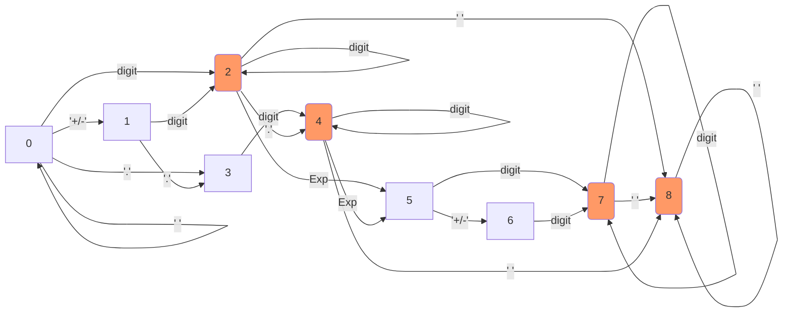

 # Notes on LeetCode [65] Valid Number

## State diagram of the deterministic finite automata (DFA)

## Table-driven approach

|State\Step|' '|+/-|digit |'.'|Exp|other|  
|--|:-:|:-:|:-:|:-:|:-:|:-:|
| 0| 0| 1| 2| 3|-1|-1|
| 1|-1|-1| 2| 3|-1|-1|
| 2| 8|-1| 2| 4| 5|-1|
| 3|-1|-1| 4|-1|-1|-1|
| 4| 8|-1| 4|-1| 5|-1|
| 5|-1| 6| 7|-1|-1|-1|
| 6|-1|-1| 7|-1|-1|-1|
| 7| 8|-1| 7|-1|-1|-1|
| 8| 8|-1|-1|-1|-1|-1|
